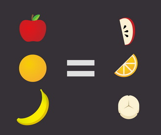

# Hack Off The Hill 8: Intro to React

In this workshop, you will learn what React.js is, why we use React to create amazing websites, and dive into how to start your own React application!

**Teachers**: [Nareh Agazaryan](https://github.com/nareha), [Eric Yang](https://github.com/eric8yang)

## Resources
- <a href="https://tinyurl.com/hoth8-react-slides" target="_blank">Slides</a>
- <a href="https://code.visualstudio.com/download" target="_blank">Text Editor (VS Code)</a>

## What we'll be learning today

- [Background](#background)
  - [What is React?](#what-is-react?)
  - [Why use React?](#why-use-react?)
- [Setting Up React Apps](#setting-up-react-apps)
- [Working with React Apps](#working-with-react-apps)
  - [Syntax](#syntax)
- [Components](#components)
- [Props](#props)
- [*array*.map()](#array.map())
- [Finished Demo](./react-app)

## Background
### What is React?
React is a Javascript framework founded and maintained by Facebook. It's currently one of the most important skills to have if trying to go into web/app development. React allows for users to build interactive user interfaces easily with the help of real-time updates. You can learn more about React here: 
- <a href="https://reactjs.org" target="_blank">React Website</a>
### Why use React?
React is the top Javascript extension that recruiters are looking for. Many of the top tech companies (including Facebook, Netflix, Twitter, Reddit, etc.) use React to design their webpages. The framework is best known for its ability to create **components** that break down a page into smaller sections. These components can also be reused and customized to display repeated features with different information (think of a Facebook feed where every post is slightly different).
## Setting Up React Apps
One of the first steps to working with React is installing Node.js, which can be found here:
- <a href="https://nodejs.org/en/" target="_blank">Node Website</a>

Node allows for users to create a development server where changes in the code you are working on can be displayed in real-time. The next step is to open up Terminal(Mac) or Powershell(Windows). VSCode, which is used in this workshop, provides a convenient terminal within the editor itself. The line you'll need to run in your terminal to set up React is `npx create-react-app <app_name>`. After doing this, you run `npm start` for Node to begin your development server.

## Working with React Apps
The first thing you'll notice when working with React apps is that the default page will just show some random React information. However, you'll be able to edit this through changing things in your `App.js` file, which is the main Javascript file that is "rendered." What this means is that React will go ahead and insert the code you write into the HTML in your `index.html` file at the `div` element with `id="root"`. When you first create your app, feel free to explore around to better understand this concept. 

When creating components, you will need to create a new `.js` file and utilize imports and exports. Essentially, at the end of your components, you will want to include a line that says `export default <component_name>` with the component name filled in. Your component will be defined by a `function <component_name>()` that returns the elements that you want rendered. In your `App.js` file, you can import your component by writing `import <component_name> from '<path_to_component>'`. You will then be able to create elements of this type within your file. For example, if we are creating a **Post** component, after importing it into `App.js` we will be able to write: `<Post />` to display a post.

### Syntax
React takes advantage of a new type of syntax called JSX. JSX is code that looks like HTML but in reality defines a React element. An example of this would be:
`const elem = <h1>I love Hack</h1>;`

JSX elements are what you will return from your functions and are also what is "replacing" the "root" in `index.html`. On top of just looking like HTML though, JSX elements are able to evaluate whatever you put in curly braces. An example of this would look something along these lines:
```js
const committee = ‘Hack’;
const elem = <h1>I love {committee}</h1>;
```
Result: I love Hack

## Components
One of the most important parts of React is the idea of components. Essentially, components allow you to reuse your code to display UI elements over and over. For example, here is a snippet of Facebook's code: 


As you can see, it would be tedious to just copy paste our long div's over and over so components help simplify the process. Breaking down a page into separate components also allows to code everything easier, for we can focus on one part at a time rather than coding an entire page. Here is a possible of a Facebook post (some of these can be broken down even further if necessary)


In our demo, we explore the creation of a ~~Facebook~~ Fakebook post component combining what we know about JSX and HTML/CSS.

## Props
We have an idea of components and how to create our own, but so far we've been hard coding the information we want to have within the component. How do we customize the infomation within the component to have different info without repeating the code over again?

That's where **props** come into play. Props is a parameter we can pass into our component function in order to use the same framework (the same component), but have different information displayed.

Take the following `Song` component, for example.

```js
function Song(props) {
    // the code for your component
}
```

If we want to make some `Song` objects we can do the following.

```js
<Song name="Toxic" artist="Britney Spears" />
<Song name="DNA." artist="Kendrick Lamar"  />
<Song name="90’s Love" artist="NCT U"  />
```

Now we have three song components. Remember that components are reusable, so we can make multiple songs easily! But where do props come in in this code? Well, the `name` and `artist` part of our component will be taken as a prop in the code. Let's see a more direct example.

As a formal definition, props is a *parameter* of our component function that is an *object* containing all the information we give the component.

That means, instead of hardcoding songs in the following manner,

```js
function Song() {

    return (
    <div>
        <p>Artist: Kendrick Lamar </p>
        <p>Name: DNA. </p>
    </div>
    );
    
}
```

We may pass props and reuse this component! If I wanted to pass one of the earlier `Song` objects I made, our `Song` component function could look like this!

```js
function Song(props) {

    return (
    <div>
        <p>Artist: {props.artist} </p>
        <p>Name: {props.name} </p>
    </div>
    );
    
}
```

As we see here, `props.artist` will display the artist attribute of the props object that we pass, and `props.name` will display the name attribute of the props object that we pass. We use the curly brace to allow for JSX expressions and variables inside of our code. If we didn't put the curly brace, our `Song` component would just render:

```
Artist: props.artist
Name: props.name
```

But now, we will see

```
Artist: Kendrick Lamar
Name: DNA.
```

Props are extremely useful and play in important part in reusable components in React!

## *array*.map()
Before we get into `array.map()`, let's define arrays!

Arrays are a collection of items of the same type. You make have an array of number `[1, 2, 3, 4, 5]`, or an array of strings `[“hello”, “this”, “is”, “an”, “array”]`, or really any data type! Arrays are very convenient for storing items of the same data type.

What if we wanted to process the array and modify the array or use it within our code? In JavaScript, we have a handy function called `.map()`. What this allows us to do is to run a for loop on an array.

Specifically what `array.map()` does is take every item in the array, perform a specific operation (as defined by the function we give), and return a new array that is the result of that operation.

That sounds like... a lot. But we can break it down with some basic examples! Take some imaginary array of fruits for example. We have an apple, orange, and a banana.



We will go through the array, so for each fruit, we will do something to it. I've decided that I like eating sliced fruit, so we're going to slice all the fruit in the array (this will be our operation for each element in the array). Once we cut every fruit in the array, I will be able to give back a new "array" of fruits consisted of apple slices, orange slices, and banana slices! I'm getting hungry... but now we must see this in action with actual code.

Let's take an array of the first 5 positive even numbers.

```js
const evens = [ 2, 4, 6, 8, 10 ];
```

I've decided I want to divide all my even numbers by 2. We can call `array.map()` to help us accomplish this!

```js
const evens = [ 2, 4, 6, 8, 10 ];
const newNumbers = evens.map( num => { return num / 2 });
```

We call the `array.map()` function for evens to loop through the entire array of even numbers. The function inside of the parantheses of map takes each number (which we call num) and returns that number divided by 2.

Now we should have an array with all of our original numbers divided by 2! If we go into our browser console and run `console.log(newNumbers);` after entering the previous two lines, we will get the desired output of `[ 1, 2, 3, 4, 5 ]`!

## Finished Fakebook

Now that we know about props, lets add that to our `Post` component!

```js
function Post(props) {
    return (
      <div className="postBox">
        <div className="account">
          <strong>{props.account}</strong>
        </div>
        
        ...
      </div>
    );
}
```
We add `props` to the component function parameters inside the parantheses, and modify account and image to display `{*props*.account}` and `{*props*.image}` respectively!

We can take out the image important statement in `Post.js`, since we don't need to import specific images and hardcode them here!

Now that `Post.js` is ready, let's use what we learned about `prop`s and `array.map()` and apply it to `App.js`!

We can start my importing all the necessary images for our posts, and create an array that holds each post, with an account text and an post image property.

```js
/* images for posts */
import image from './images/event.png';
import hacksprint from './images/hacksprint.png';
import impact from './images/impact.png';

const posts = [
  {
    account: 'ACM at UCLA',
    image: image
  },
  {
    account: 'Eric Yang',
    image: hacksprint
  },
  {
    account: 'Nareh Agazaryan',
    image: impact
  }
];
```

The import syntax is similar to how we imported images previously! In addition, we now have a variable `posts` that is an array of some properties! Each element in the array has an account and an image property. We will utilize this really similarly to how we utilized `props`! Let's take a look at the rest of the code, the actual `App()` function!

```js
function App() {
  return (
    <div className="App">
      {
        posts.map( post => {
          return <Post 
            account={post.account}
            image={post.image}
            key={post.account}
          />
        })
      }
    </div>);
  
}

export default App;
```

As we see here, the App will display something based off the `posts.map()` function, which is our implementation of `array.map()`! Let's break it down.

We see that `posts.map()` is of similar syntax to our earlier examples. We will have some function in the parantheses that takes each post (each element in the `posts` array) and returns (displays on the screen, in this case) a `Post` component based on the account and image property that we specified earlier!

Similar to how we did: 
```js 
<Song name="DNA." artist="Kendrick Lamar"  />
```
and to how we called props in our `props` additions in `Post.js`, we take the account and image components of each post, and pass that into props for our Post component!

For example, with
```js
account: 'ACM at UCLA',
image: image
```
it is equivalent to if we rendered a post component in the manner we learned earlier.
```js 
<Post name='ACM at UCLA' artist={image}  />
```
However, we may process many, *many* posts from the array efficiently and avoid repeating many lines of code for each style of the component!

> You may notice we have added a `key` property to the map function. This is because of the following error that you may find in your console. Of course, it is just a warning, but it is best practice to fix all warnings as it may lead to issues down the development road!

> There is a bit of a complex and involved reason for why React would prefer the key prop, but the explanation is out of the scope of this workshop. If you're interested in learning about it, a great and thorough explanation can be found <a href="https://reactjs.org/docs/reconciliation.html" target="_blank">here</a>!

Now our Fakebook is complete!

## More React Topics
If you'd like to continue your React tutorial, the React documentation is a great way to get started. They also have a <a href="https://reactjs.org/tutorial/tutorial.html" target="_blank">tutorial</a> on their website!
